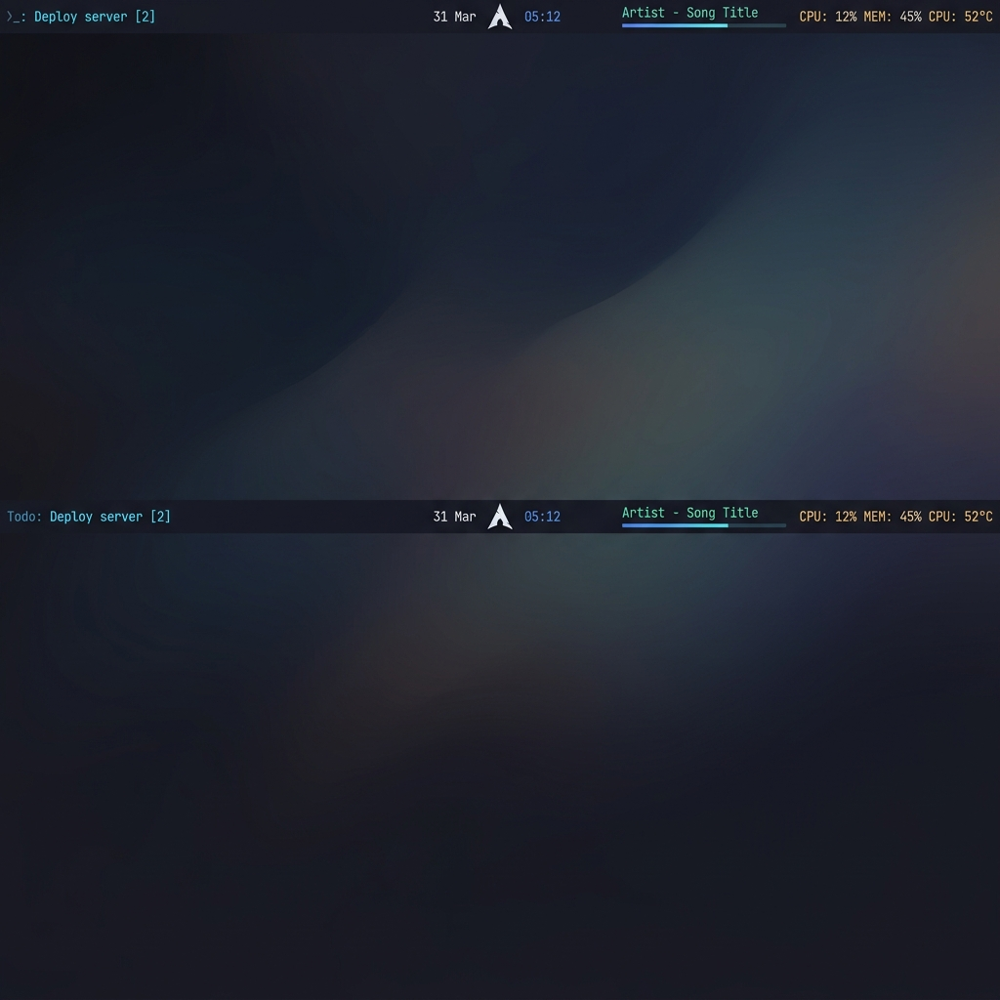

<p align="center">
  <h1 align="center">Zenith</h1>
  <p align="center">
    A brutally fast, zero-compromise Wayland status bar for Hyprland.
    <br />
    Built in Rust. Styled with intention. Designed to disappear.
  </p>
</p>

<p align="center">
  <a href="https://github.com/CPT-Dawn/Zenith/blob/main/LICENSE">
    
  </a>
  <a href="https://aur.archlinux.org/packages/zenith-bar">
    
  </a>
  <a href="https://github.com/CPT-Dawn/Zenith/actions">
    
  </a>
  
  
</p>

<br />

<p align="center">
  
</p>

<br />

---

## Why Zenith?

Most status bars try to be everything. Zenith tries to be **invisible** — a 28-pixel strip of exactly the information you need, rendered at the speed of a compiled binary, consuming single-digit megabytes of RAM.

- **Native Wayland** — No X11 compatibility layers. Pure `wlr-layer-shell` via GTK4.
- **Compiled, not interpreted** — Rust with LTO, stripped symbols, single codegen-unit. Startup in under 50ms.
- **Zero-blocking I/O** — External processes (playerctl) run on background threads. The main GTK loop never stalls.
- **Opinionated aesthetics** — Tokyo Night Storm palette, Inter + JetBrainsMono Nerd Font typography, hand-tuned spacing. Beautiful by default, fully customizable via CSS.

---

## Features

| Module | Description |
|---|---|
| **Clock** | Configurable `strftime` format with per-second updates |
| **Calendar** | Clickable date badge → full GTK4 calendar popover |
| **System Stats** | Real-time CPU %, memory %, and CPU temperature with color-coded thermal states |
| **Media Player** | `playerctl`-powered now-playing with artist/title, play/pause toggle, and a 60fps smoothly-interpolated progress bar |
| **Todo List** | Full CRUD task manager with priority levels (P1–P9), persistent JSON storage, and an inline progress bar |

**Additional highlights:**

- 🎨 **Fully themeable** — Every element is a CSS class. Ship your own `style.css`.
- ⚙️ **Deep merge config** — Only override what you change. Missing keys fall back to sane defaults.
- 🖥️ **Multi-monitor** — Target a specific output by connector name (`DP-1`, `HDMI-A-1`, etc.).
- 🔲 **Floating or flush** — Switch between a flush edge-to-edge bar and a floating pill with animated RGB borders — just change two config values.
- 🧱 **Atomic persistence** — Todo data is written via temp-file + rename. No corruption on crash.

---

## Installation

### Arch Linux (AUR)

The recommended installation method for Arch users:

```bash
# Using paru
paru -S zenith-bar

# Using yay
yay -S zenith-bar
```

### Manual Build

**Dependencies:** `gtk4`, `gtk4-layer-shell`, `rust` (1.70+)

```bash
# Clone the repository
git clone https://github.com/CPT-Dawn/Zenith.git
cd Zenith

# Build the optimized release binary
cargo build --release

# Install to your PATH
sudo install -Dm755 target/release/zenith /usr/local/bin/zenith

# (Optional) Install default config and style templates
install -Dm644 Default_Config.toml ~/.config/zenith/config.toml
install -Dm644 Default_Style.css ~/.config/zenith/style.css
```

> [!TIP]
> If you skip the optional config step, Zenith will automatically create `~/.config/zenith/config.toml` and `style.css` with sensible defaults on first launch.

---

## Configuration

Zenith reads its configuration from:

```
~/.config/zenith/config.toml   # Behavior, geometry, module toggles
~/.config/zenith/style.css     # Full CSS stylesheet
~/.config/zenith/todos.json    # Todo persistence (auto-managed)
```

Override the config path at runtime with `ZENITH_CONFIG=/path/to/config.toml`.

### `config.toml` — Quick Reference

```toml
[bar]
# Monitor connector (leave commented for default)
# monitor = "DP-1"

height          = 28          # Bar height in pixels
gap_horizontal  = 0           # Side margins (0 = flush)
gap_top         = 0           # Top margin (0 = flush)
border_radius   = 0           # Corner radius (0 = sharp)
border_width    = 0           # Animated border thickness (0 = hidden)
rgb_cycle_seconds = 12.0      # Border animation cycle duration
background      = "rgba(26, 27, 38, 0.95)"

[modules]
clock        = true
clock_format = "%a %H:%M"    # strftime syntax
system_stats = true
playerctl    = true
todo         = true
```

### Switching to Floating Mode

To transform Zenith from a flush top bar into a floating pill with an animated RGB border:

```toml
[bar]
height         = 36
gap_horizontal = 12
gap_top        = 8
border_radius  = 14
border_width   = 2
```

### Styling

The stylesheet at `~/.config/zenith/style.css` uses standard GTK4 CSS. Every widget has a semantic class name (e.g. `.zenith-module-surface`, `.zenith-player-title`, `.zenith-todo-row`).

Key classes for customization:

| Class | What it controls |
|---|---|
| `.zenith-inner` | Main bar background surface |
| `.zenith-module` | Base typography for all modules |
| `.zenith-module-surface` | Hover/active background for interactive elements |
| `.zenith-module-left` | Left cluster accent color (Todo) |
| `.zenith-module-center` | Center cluster accent color (Clock/Calendar) |
| `.zenith-module-right` | Right cluster accent color (System/Player) |
| `.zenith-module-temp-cool` | Temperature < 50°C |
| `.zenith-module-temp-warm` | Temperature 50–75°C |
| `.zenith-module-temp-hot` | Temperature > 75°C |

**Font requirements:** [Inter](https://fonts.google.com/specimen/Inter) and [JetBrainsMono Nerd Font](https://www.nerdfonts.com/font-downloads) are expected. Zenith degrades gracefully to system sans-serif/monospace if they are not installed.

---

## Hyprland Integration

Add a few lines to your `~/.config/hypr/hyprland.conf` for the best experience:

### Auto Start

```ini
exec-once = zenith
```

### Background Blur

```ini
# --- Zenith Status Bar ---
layerrule = blur on, match:namespace zenith
layerrule = ignore_alpha 0.3, match:namespace zenith
```

The `ignorealpha 0.3` threshold ensures only the bar surface is blurred — fully transparent regions (e.g., gaps in floating mode) are left untouched.

## Runtime Environment

| Variable | Purpose |
|---|---|
| `ZENITH_CONFIG` | Override config file path |
| `ZENITH_STYLE` | Override style file path |
| `ZENITH_DEFAULT_CONFIG_TEMPLATE` | Override the default config template used on first launch |
| `ZENITH_DEFAULT_STYLE_TEMPLATE` | Override the default style template used on first launch |
| `RUST_LOG` | Control log verbosity (`info`, `debug`, `trace`) |

---

## Architecture

```
main.rs          → env_logger → config::load() → GTK Application → ui::build_bar()
config.rs        → TOML parsing, deep merge, first-run scaffolding
style.rs         → CSS template rendering, token substitution, backward-compat injection
ui.rs            → wlr-layer-shell window, CenterBox widget tree, monitor targeting
modules/
  clock.rs       → 1s chrono timer
  calendar.rs    → Date button + Calendar popover (60s refresh)
  system.rs      → sysinfo CPU/mem + sysfs thermal (2s polling)
  playerctl.rs   → Background-thread subprocess polling + 60fps progress lerp
  todo.rs        → CRUD + priority + atomic JSON persistence
```

---

## Contributing

Contributions are welcome. Before submitting a PR:

1. Run `cargo clippy -- -D warnings` and ensure zero warnings.
2. Run `cargo fmt --check` to verify formatting.
3. Test on a live Wayland session (Hyprland preferred).

---

## License

[MIT](LICENSE) © Swastik Patel
